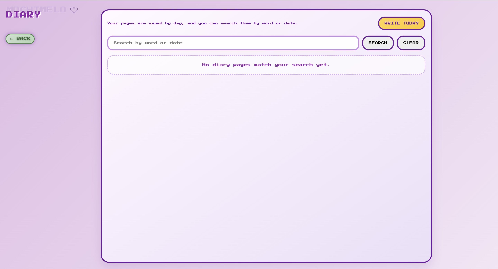

# 💜 Mochimelo – Your Cute Digital Diary & Memory Space

> Capture your thoughts, memories, and moments in the most adorable way possible 🐰✨

Mochimelo is a beautifully designed web app that lets you write daily diary entries and create photo memory pages—your own personal safe space on the internet.

---

## ✨ Features

- 📖 **Digital Diary**
  - Write daily entries
  - Automatically organized by date
  - Search entries by keyword or date

- 🖼️ **Photo Memory Pages**
  - Create custom memory boards
  - Add and organize your favorite photos
  - Personalize your memories

- 🔍 **Search System**
  - Quickly find past diary entries
  - Filter by words or dates

- 👤 **User Authentication**
  - Create account & login system
  - Simple and clean UI

- 🎀 **Aesthetic UI**
  - Soft pastel theme 💜
  - Cute pixel-style design 🐾
  - Smooth and calming experience

---

## 🎯 Highlights

- 🌸 Beginner-friendly and intuitive  
- 🧠 Acts like a personal emotional space  
- 💾 Data stored locally (no external dependency)  
- ⚡ Lightweight and fast  

---

## 🖥️ Screenshots

### Home Screen


### Choose Mode


### Diary Section


### Photo Memory


### Login / Signup


---

## 🛠️ Tech Stack

- **Frontend:** HTML, CSS, JavaScript  
- **Storage:** Local Storage  
- **Design:** Soft UI + Pixel Aesthetic  

---

## ⚙️ How to Run

```bash
# Clone repository
git clone https://github.com/Aakira14/mochimelo.git

# Open folder
cd mochimelo

# Run project
Open index.html in your browser
